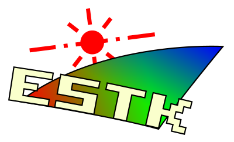
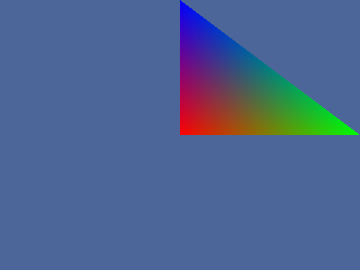
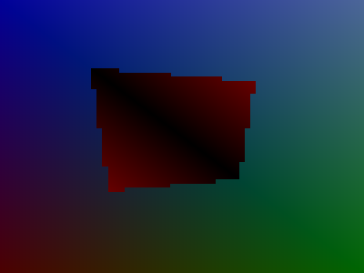
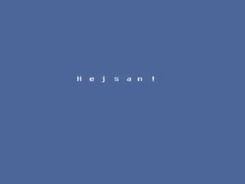

# Overview

OpenGL ES Toolkit v5.0.0-dev is a wrapper library working with *OpenGL ES 2.0*.

This project is a continuation of [ESTK](https://github.com/carlmartus/estk)
which can be considered version 1.0 of libestk.

*LibESTK* is a utility library ment to make *OpenGL ES 2.0* operations easier
to perform with fewer calls compared to the standard *OpenGL* library. This
is compatible with *Emscripten*.

Documentation can be found [here](DOC.md).

# Features
 * FPS bound game loop
 * OpenGL ES Compatibility
 * WebGL compatibility
 * Emscripten compatibility
 * GLSL Shaders wrapper
 * OpenGL vertex buffer wrapper
 * Projection matrix generators
 * Texture file loading
 * Quaternion rotations
 * Keyboard/Mouse event wrapper
 * Sound file loading and playing

# Screenshots






# Usage

## Dependencies
 * OpenGL ES 2.0
 * CMake
 * SDL
 * SDL_image
 * SDL_mixer
 * GLEW


## Compilation
  First generate the build environment with cmake:
```
cmake .
```

  Now build the projet with:
```
make
```

The library and all the demos can now be found in the ```bin``` directory.

If you wish to add the library to your system run this:
```
make install
```

To compile a *Emscripten* compatible static library, execute the script
```compile_emscriptenlib.sh```. This requires a functional *Emscripten*
installed.

# Todo

 * [ ] esGame_ quit function

