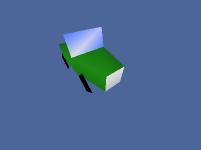

# Overview

OpenGL ES Toolkit v6.1.0-dev is a wrapper library working with *OpenGL ES 2.0*.

This project is a continuation of [ESTK](https://github.com/carlmartus/estk)
which can be considered version 1.0 of libestk.

*LibESTK* is a utility library ment to make *OpenGL ES 2.0* operations easier
to perform with fewer calls compared to the standard *OpenGL* library. This
is compatible with *Emscripten*.

Documentation can be found [here](DOC.md).

# Features
 * FPS bound game loop.
 * OpenGL ES Compatibility.
 * WebGL compatibility.
 * Emscripten compatibility.
 * GLSL Shaders wrapper.
 * OpenGL vertex buffer wrapper.
 * Projection matrix generators.
 * Texture file loading.
 * Quaternion rotations.
 * Keyboard/Mouse event wrapper.
 * Sound file loading and playing.
 * Render to multiple textures.

# Development
 * Render to texture not ES2 compatible.
 * GLES2 mode not working with uniforms.

# Screenshots





# Usage

## Dependencies
 * OpenGL ES 2.0
 * CMake
 * *SDL2*
 * *SDL2_image* (optional)
 * *SDL2_mixer* (optional)
 * *GLEW* (Optional on *nix* systems)

In Debian like Linux distros, a development environment can be installed with:

```
sudo apt-get install cmake libsdl2-image-dev libsdl2-mixer-dev libglew-dev libsdl2-dev
```


## Compilation

### Traditional compilation

First generate the build environment with cmake:
```
mkdir build
cd build
cmake ..
```

Now build the projet with:
```
make
```

The library and all the demos can now be found in the `bin` directory.

If you wish to add the library to your system run this as root:
```
make install
```

### Emscripten

This kind of compilation requires a installment of *Emscripten*. To compile the
library with *Emscripten*, you must run *CMake* with a tool chain file from the
*Emscripten* SDK:
```
ccmake -DCMAKE_TOOLCHAIN_FILE=[Path to Emscripten]/cmake/Modules/Platform/Emscripten.cmake ..
```

In the configuration GUI, set the option ```ES_OPT_EMSCRIPTEN``` to ```YES```.

If you want *ESTK* to be a part of the *Emscripten* SDK (Recomended) set the
parameter ```CMAKE_INSTALL_PREFIX``` to ```[Path to Emscripten]/system```.

Now build the projet with:
```
make
```

If you want to integrate *ESTK* into your copy of the *Emscripten* SDK run:
```
make install
```

# Todo

 * [ ] Shared uniform system
 * [ ] User param pointer as argument on all callbacks
 * [ ] Window resize event

